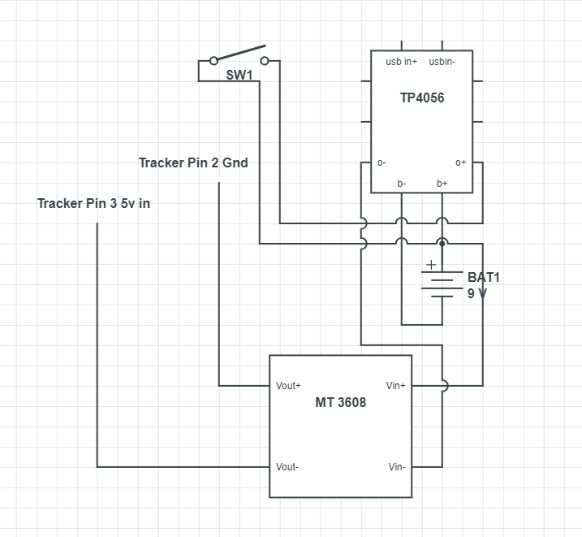
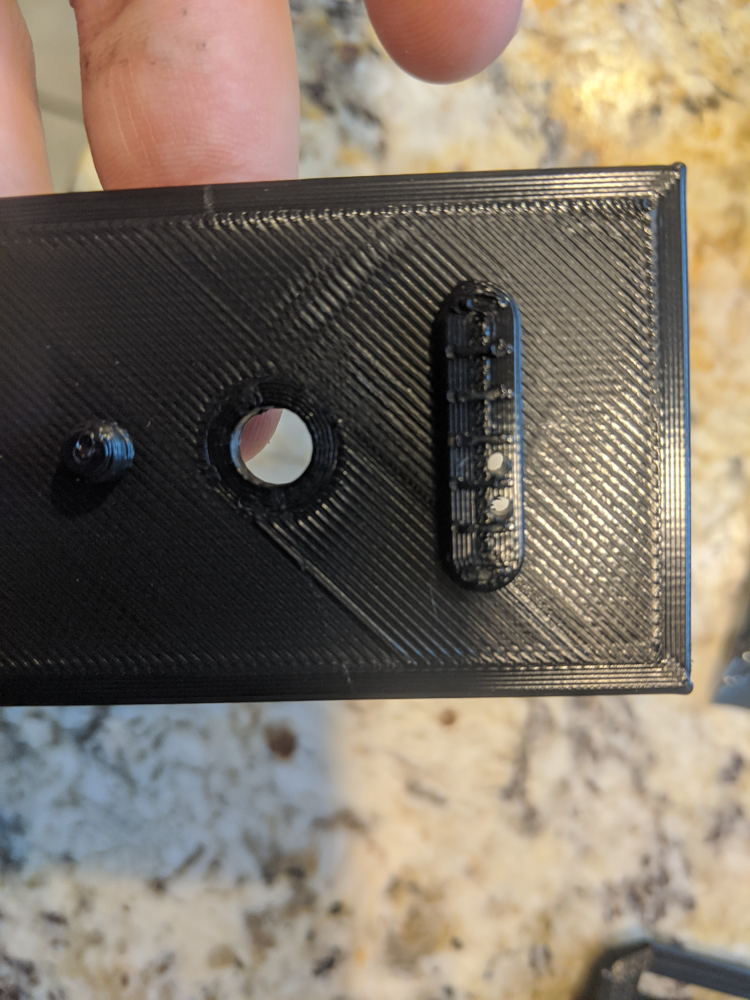
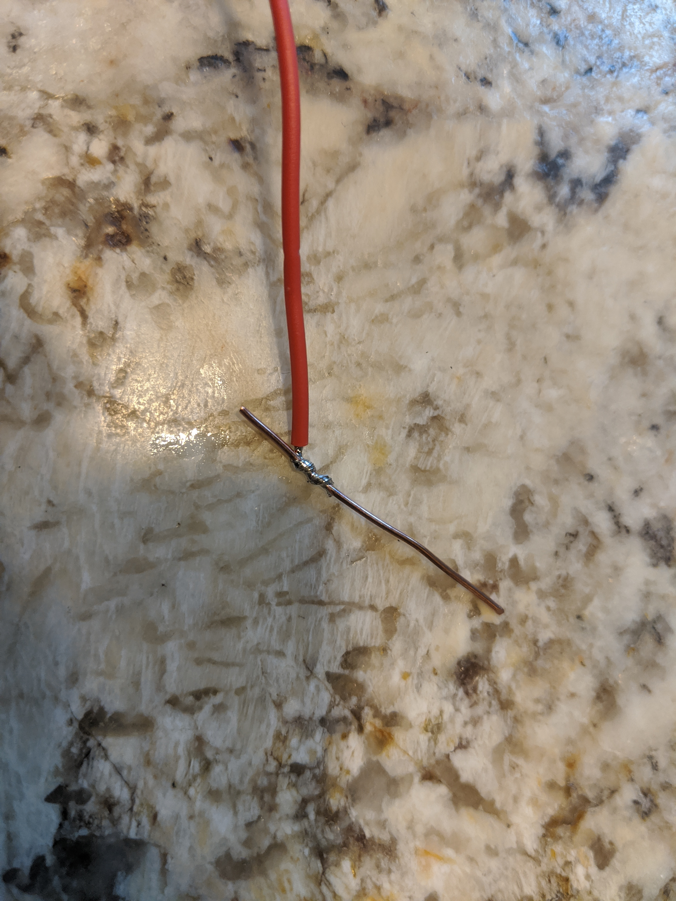
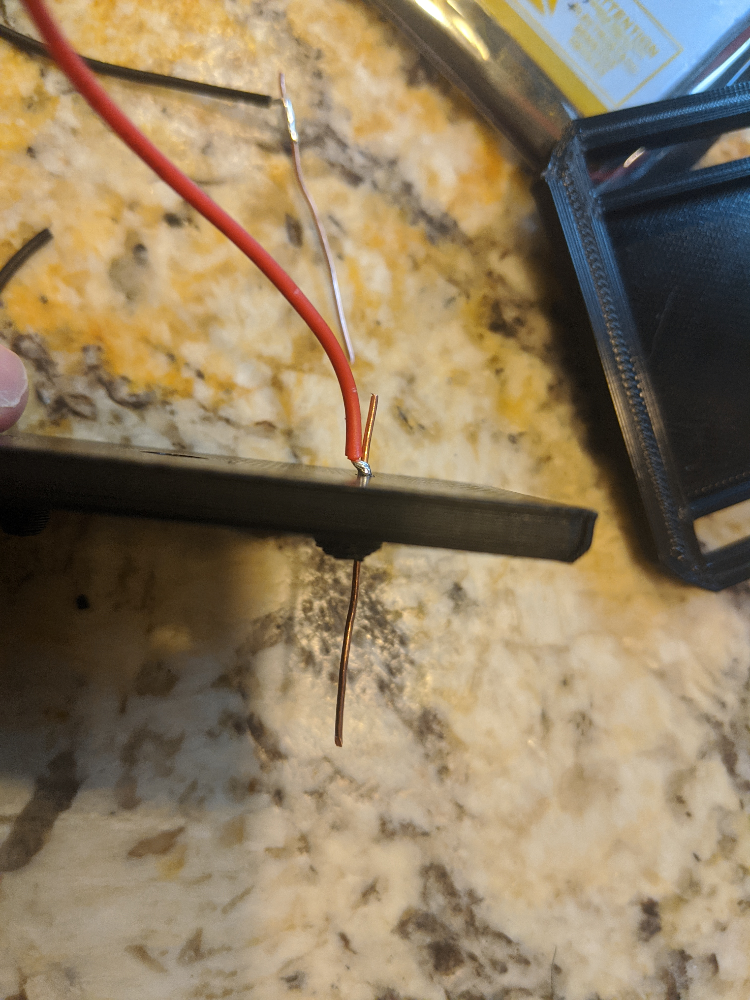
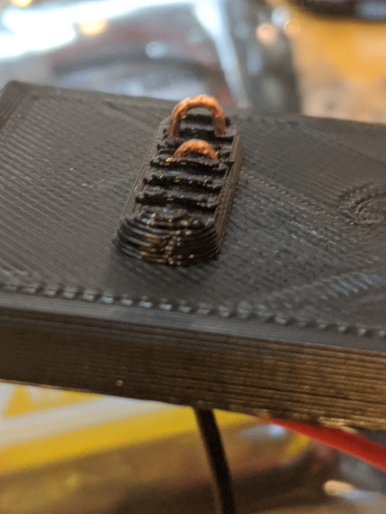

# Vive Tracker Battery Bank Guide

> A tutorial/log on how to make an extended battery pack for htc vive trackers.

## Table of Contents (Optional)

- [Features](#features)
- [Part List](#parts)
- [Tool List](#tools)
- [Diagram](#diagram)
- [Misc](#misc)
- [License](#license)

---

## Features

- 5-7 **Additional** hour battery life for a **total of 8-10 hours**
- relatively small form factor
- no external wires
- charging via 1 port

---

## Parts

- MT 3608 Boost Converter (“2A” version)
- TP 4056 Battery Module with Battery protections
- 7 *M2x10mm (self tapping screws/ flat heads) 4mm head
- 1/4” mounting screw  10mm shaft
- Switch (5mm knob CYT1107)
- Stranded Copper Wire 22 gauge
- Solid copper Wire 18-24 gauge (I use unshielded craft wire)
- 504050 Li-poly battery (ideally w/ battery protection circuit, and ~1500 maH capacity)
- ~25 Gram Filament (I use PLA, though higher temp plastics might be easier to work with)
?s=200` at the end of the image URL.

---

## Tools

### Required

- Various Screw Drivers
  - Large flat-head for tripod screw
  - small for m2 screws (dependent on what you buy)
  - very-small flat-head for adjusting potentiometer on MT 3608 board.
- Soldering Iron w/ solder (and comfortable w/ working on ~ 3 mm pads)
- small needle nose pliers
- wire cutter
- wire strippers
- Basic Multimeter/Voltmeter
- 5v Power supply ending in Micro USB (i.e. usb port) [ideally 1A plus]
- Drill w/ 1/16" and 5/64" bit
- SuperGlue or Hot Glue

### Recommended

- current clamp
- USB voltmeter/ammeter etc. (something like "AT34")
- helping hands, and other soldering assistant tools
- sand paper or other for extra plastic removal
- heat-shrink tubing
- mounting options ( I use elastic for feet and a belt for waist )
- kapton tape
- misc tape

---

## Diagram

---

## Tutorial

1. Print off all Three Parts of the Tracker.

2. Take the top of the tracker and using the 1/16" drill bit drill out a hole for pins 2 and 3, near top or Bottom of the "slot"

3. Solder some of the stranded wire to a piece of plain copper wire, then feed the piece through the holes made.

4. Make a Hook with the needle nose pliers, and then using soldering iron "melt" the hook into the tracker base to allow the wire to be secured to the top.

  - The hook should rise ~1mm above the lips in the model seperating the pad.
  - At this point it is HIGHLY recommended to place the tracker on the front, and attach a 5v power supply to the pins to ensure that the electrical connection is good with the pogo pads.
  
  

5. Now we will mount the two circuit boards, Holding or attaching  the mid piece to the top piece you can arrange and fix the pcbs to the top

  - I usually achieve this by taking a small piece of copper wire (no shielding) and melt it into the top. with a soldering iron, and then Solder the pin to the pcb.
  - The tp4056 port should be flush with the outide of the case.
  
6. Now Assemble the remaining wires per the diagram, But leave the battery for last, and you may want to Test before adding the battery.

  

  - you can use shrink wrap tubing here to make a somewhat sturdier platform
  
7. Adjust the boost converter, Hook it up to a power supply, and test the output voltage with a voltmeter.
    
  - the potentiometer can be adjusted by slowly rotating the knob, your goal is 5V output per spec the tracker should be able to handle +- 5% so I typically aim for 5.05v or so to handle some voltage drop at load.
    
	
8. (optional) Test Tracker, moutning it, and watching a current draw from a USB power meter or similiar.
  - you will see a low current draw at the start, and then after 5-10 seconds it should jump to a max of ~500 mA (The amount of draw will depend on charge state of tracker)
9. Attach battery, it is a friction fit into the bottom part of the tracker, do not force it overly.
    
	
	
  - you may need to sand down your bottom part slightly to let the battery fit.
  - you may want to kapton tape down the wires from the battery to prevent them from getting snapped in the side.

10. (optional) test battery, see that it charges from wall decently, switch should be off for wires to boost converter.

11. pre-drill holes for screws 3 on top and 4 on bottom, though there is no real golden rule here.
  - **Caution** you do not want to puncture the battery and have very little wiggle room
  - use the 1/16" to drill ~75% of the entire length
  - use the 5/64 to drill most of the first layer.
  

12. Assemble Top half

    
	
  - using super glue or hot glue position the switch correctly, and  then screw the top two parts together.
  
13. Attach Tracker
  - using tripod screw, attach the tracker to the battery pack

14. Assemble Bottom
    
	
	
  - Carefully Screw in bottom screws.

---

## Misc

- Additional pictures in the "Pics" folder
- STL/OBJ files in the models folder

---

## License

- **[Creative Commons Attribution, No Commercial, Share-alike](https://creativecommons.org/licenses/by-nc-sa/4.0/)